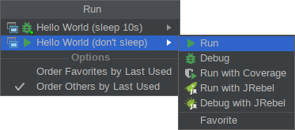

IDEA Run Popup Plugin
=====================

A popup menu for IDEA to provide easier access to run configurations.

The popup menu shows a list of run configurations in two sections: Favorites
(first) and others. Each section can be separately configured to show the
configurations last used first or using the ordering of the run
configurations settings dialog.

For each entry, the popup remembers the last executor used (Run, Debug,
etc.)

The popup menu is searchable and also handles searching for the first
letters of words (e.g. search for "riwp" to find "Run IDEA with plugin").

It can be both placed into the toolbar or bound to a key. It can replace the
default run dropdown.

This plugin is available in the plugin repository.

Configuration Tips
------------------

  * Remove *"Select Run/Debug Configuration"* action and "Run/Debug"* group
    from your toolbar and add instead *"Run Popup"*, *"Stop"* and *"Edit
    Configurations..."*. The "Stop"* action will show a drop-down to choose
    which process to stop when more than one is running (if only one process
    is running, it will just stop that one. </li>

  * By default, the run popup is bound to *Alt-X*. You may also want to bind
    *"Stop"* to *Alt-Shift-X* to get a stop popup.
